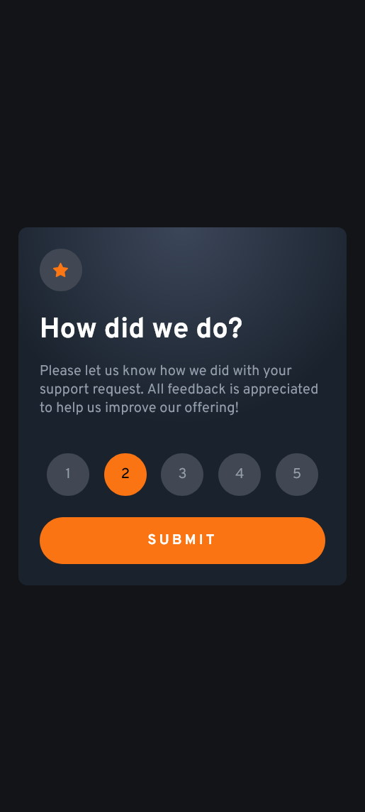
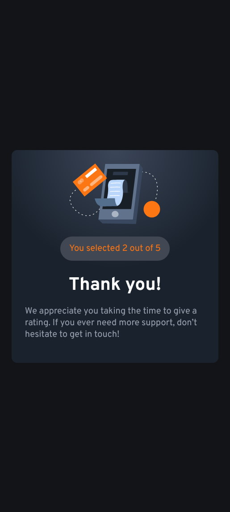

# Frontend Mentor - Interactive rating component solution

This is a solution to the [Interactive rating component challenge on Frontend Mentor](https://www.frontendmentor.io/challenges/interactive-rating-component-koxpeBUmI). Frontend Mentor challenges help you improve your coding skills by building realistic projects. 

## Table of contents

- [Overview](#overview)
  - [The challenge](#the-challenge)
  - [Screenshot](#screenshot)
  - [Links](#links)
- [My process](#my-process)
  - [Built with](#built-with)
  - [What I learned](#what-i-learned)
  - [Continued development](#continued-development)
- [Author](#author)

## Overview

### The challenge

Users should be able to:

- View the optimal layout for the app depending on their device's screen size
- See hover states for all interactive elements on the page
- Select and submit a number rating
- See the "Thank you" card state after submitting a rating

### Screenshot

 

### Links

- Solution : [GitHub repository](https://github.com/stagnant-sys/interactive-rating-component)
- [Live site](https://stagnant-sys.github.io/interactive-rating-component/)

## My process
I started by designing each box so the style was right. I wanted the submit button to be disabled until a rating was selected, and then I wanted to use the submit button to replace the first box ('Rating box') with the second one ('Thanks box') using JavaScript.

For the rating interaction, I tried to code so that when the user select one rating, it gets its selected style and all the other ones get unselected. I'm not too happy with my solution, I tried to do it using a for loop but couldn't get it to work, so I used a simple but not optimized alternative which is to unselect the others ratings one by one.

### Built with

- Semantic HTML5 markup
- CSS custom properties
- Flexbox
- JavaScript

### What I learned

I got to use the basics I know about JavaScript and how to do simple changes to the DOM. I also got to practice a lot of centering of elements inside divs (the star icon, the ratings).

### Continued development

I'd like to optimize my JavaScript more so that it's not as redundant as it is now.

## Author

- GitHub - [stagnant-sys](https://github.com/stagnant-sys)
- Frontend Mentor - [@stagnant-sys](https://www.frontendmentor.io/profile/stagnant-sys)
